# Joins with LinkNYC kiosk locations.

We will examine how we can get a count of link kiosks per zip code - with either a tabular of spatial join. All of this data used here can be found in the Link NYC folder in brightspace.

# Tabular Joins

Remember for tabular joins, we want each geographic identifier, (census tract id, zip code, etc.) to only appear in our data once. This is because the software will automatically join the data from the first time it finds a match - so if your data is not aggregated, your join will run without error, but will be completely wrong.

#For example in this Link dataset in the raw form, we see each zip code appears more than once. This makes sense, as this data is the location of each kiosk, and we can assume there are zip codes that contain more than one.

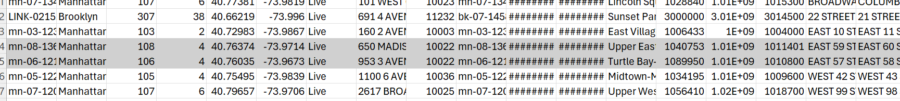

But, to use this data in a tabular join, we need to use it as structured in the zip_counts.csv, already aggregated by count. Now, there are a few ways we can get the data in this format if it wasn't already structured this way. 

## 1. Pivot Table

If you are familiar with Excel, you can preprocess the data with a Pivot table. In this case, we are grouping by the zip field, with a count of each time it appears in the dataset. 

First you will highlight the entire range of data, and navigate to Insert > Pivot Table

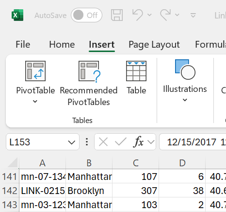

Select Table/Range and then accept the highlighted range.

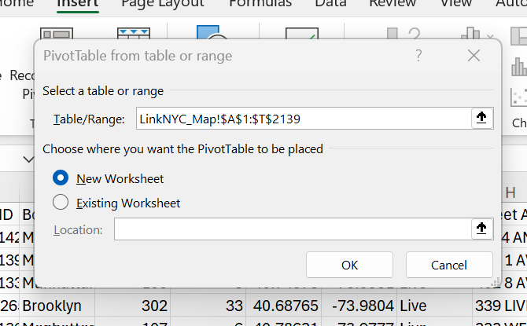

From the Pivot Table menu, Select the Postcode field (Zip) for Row field, and the Count of Postcode for the Value field.

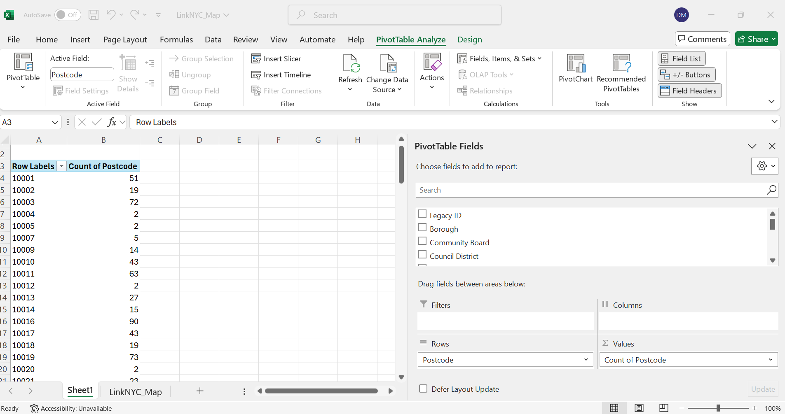

Then you could copy this data into a separate csv, and pull into GIS.

## 2. Within Pro

We can also use the Summary Statistics tool to aggregate our data in a format that it could be used in a tabular join. 

To do so, we would pull the unaggregated data in Pro as a csv, and then export as a Table object.

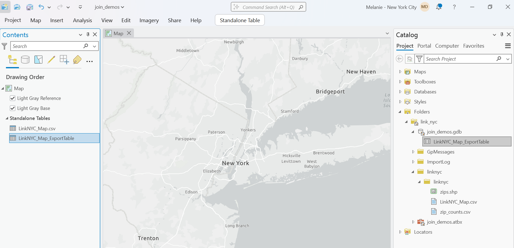

The from the attribute table, we can right-click on the Postcode field and select summarize, and fill out the fields to get a count of each time zip appears. Think about how if we wanted to aggregate on a different geographic field in the data we could select that, or a different aggregation method such as sum or average.

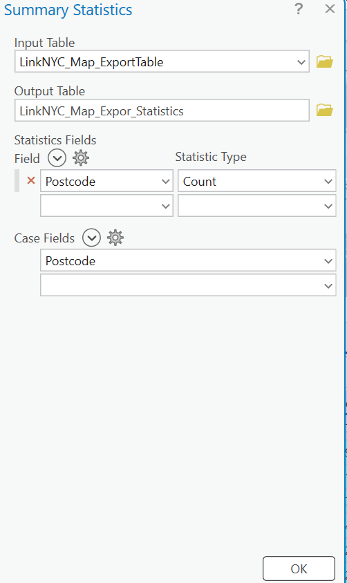

Then we would similarly have a table with a count of each time a zip code appears in our data.

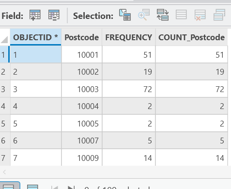

## 3. With Python in Google Colab (Using Groupby)

You can also review the exploring lodes and lab 6 processing notebook files for more groupby examples. But if you were starting from scratch, you would navigate to www.colab.researh.google.com, and open a new notebook.

Remember our first step is to import the packages we will need. For this operation, we will just need to import the pandas library.

import pandas as pd

Then, we need to get our data into the notebook. Remember Google Colab has a unique way of doing this. The syntax is:

from google.colab import files
uploaded = files.upload()

This will open a dialog where you can navigate to the unaggregated link kiosk data.

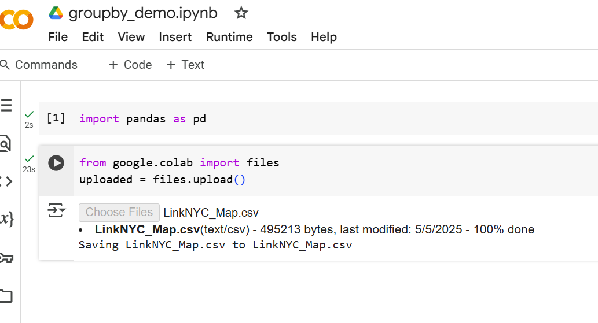

Now we will convert the raw csv we imported into the Colab environment into a pandas dataframe. The syntax is:

unaggregated_link = pd.read_csv('LinkNYC_Map.csv')

Now, all we need to do is run a groupby operation that groups by Postcode, and aggregates them as a count. They syntax is:

aggregated_link = unaggregated_link.groupby('Postcode').size()

And then we can similarly export our csv out with the colab option. The syntax is:

from google.colab import files
aggregated_link.to_csv('aggregated_link.csv', index=False)
files.download('aggregated_link.csv')

And then we can do the join on that file in Pro. If you want the link to this entire notebook it is here: [link](https://colab.research.google.com/drive/1N8LhML2YOJSUBGxKP-OXjouxMUlJ6eWV?usp=sharing)

## Luckily, I had already aggregated the data for you in the csv, zip_counts.csv

So however we aggregated our data - now we can do the tabular join.

First we pull in our spatial file and csv into a new project. In this scenario the geography would be the zip code shapefile, because that is the level our data is aggregated at.

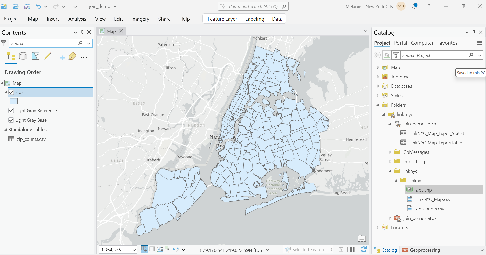

Then we should export both our csv and shapefile to the geodatabase, so we are dealing with a table and feature class.

The two main things we need for a tabular join are a shared field and for that field to be stored in the same data type. In our spatial file this is ZIPCODE, which is stored as text, and in our table this is zip, which is stored as Long. We will create a new text field in our tabular data, populate with the values of 'zip' and then complete the merge. 

First within the fields menu we will create a new field and call it something like zip_text. Make sure you set the data type to text. 

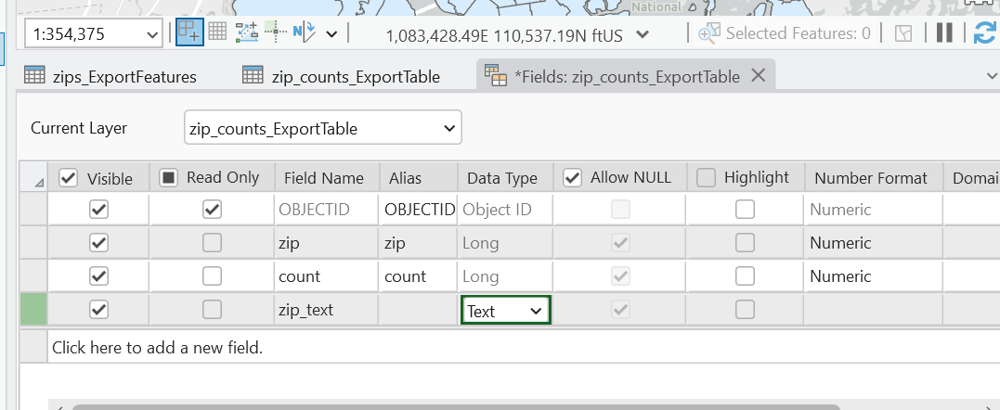

When we have our empty field, we will right-click and select Calculate Field. We just need to set zip_text to the values of zip and press Apply.

Now we have what we need to complete the Join. We will right-click on our spatial file and select Joins and Relates > Add Join. Fill out as follows:

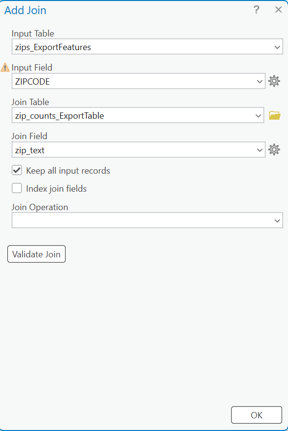

We want to select the Validate option first, so we can see the results of the join, but rememeber we still have to press OK for the join to actually run. Here we see there are 109 zip codes in the tabular data that matched to our zip code spatial file. This makes sense because link nyc kiosks are not in every zip code.

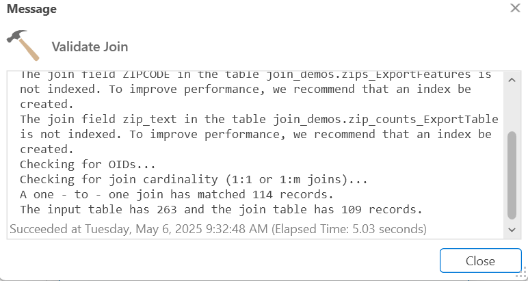

After we run the join, we can see our tabular data linked to our spatial data in the attribute table. We could then symbolize by the count field to have a visual representation of how many kiosks are in each zip code.

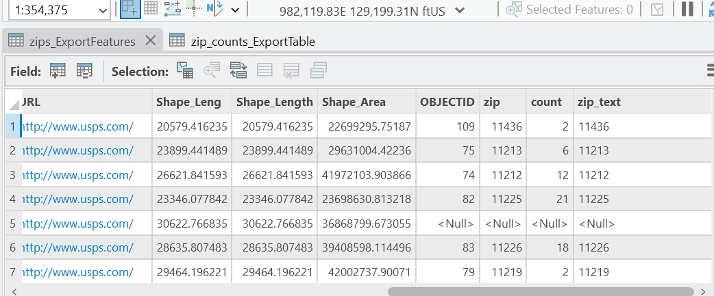

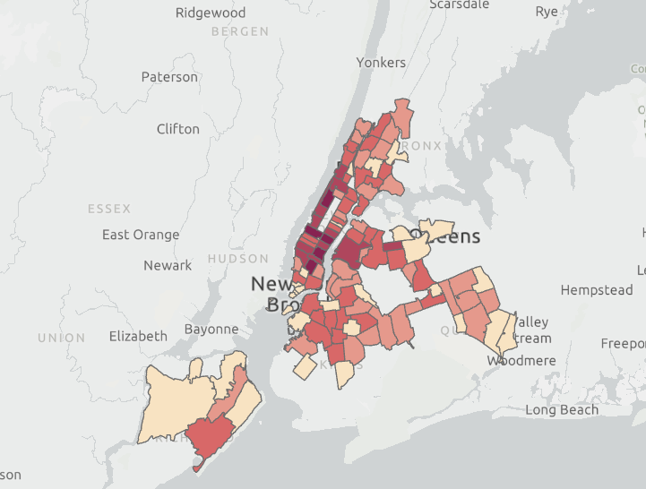

## Spatial Joins

We can demonstrate the spatial join process with the unaggregated zip code data. 

First we want to convert our kiosk tabular data to a spatial file. Since this data has coordinates we will run the XY to Point tool. Each point is one Link kiosk.

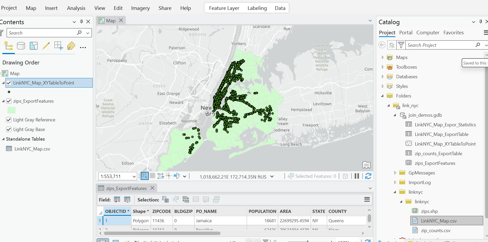

The spatial join will be doing the work of aggregating each point into our zip code polygons, based on the spatial relationship we choose. 

Right-click on our zip code spatial file > Joins and Relates > Add Spatial Join. Fill out as follows. 

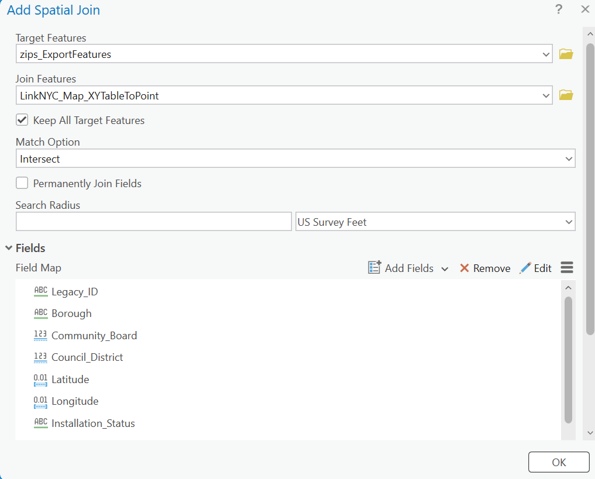

In the fields menu, we will see all fields from our point data that are set to be joined on to our zip code data. If we wanted to simplify what our output looks like, we could Remove them.

The critical field for us in this type of spatial join is a default field called Join_Count. This will show a count of all the features that were within that zip code. We could then symbolize by this field and see similar results to our tabular join output.

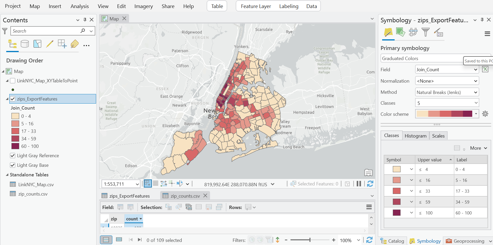