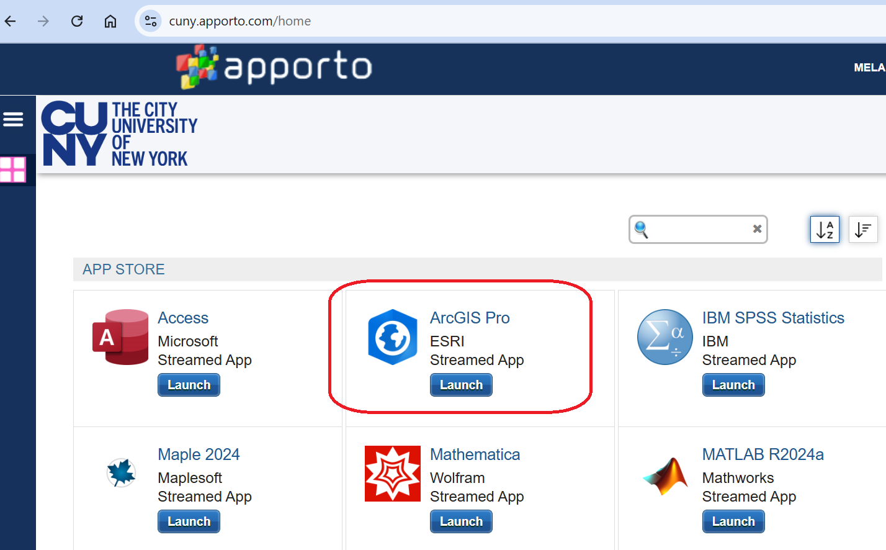
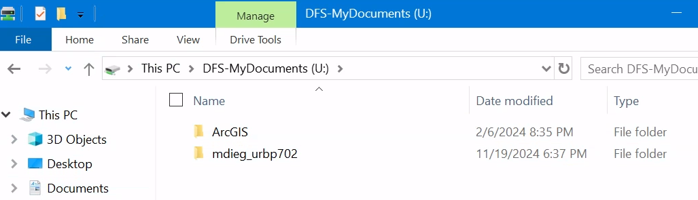
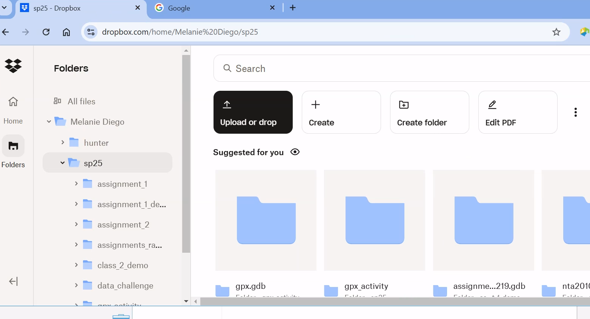
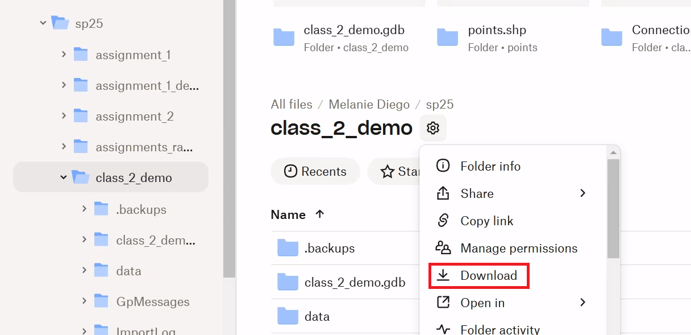
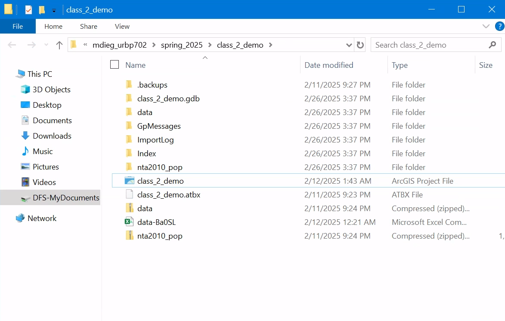
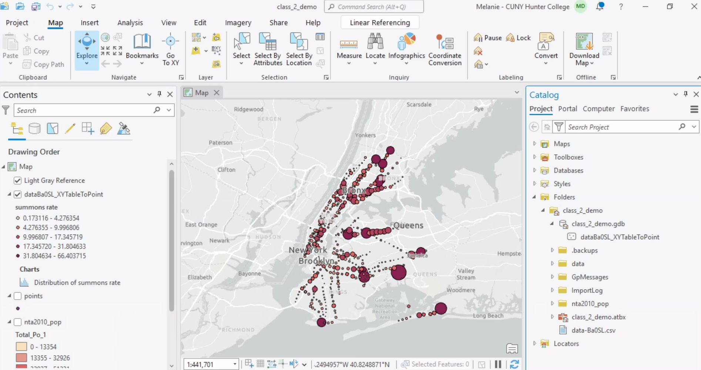
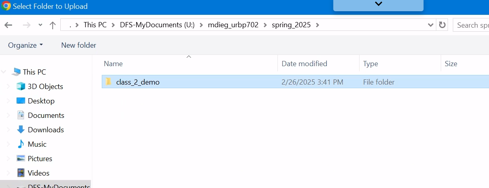

#How to access ArcGIS outside the classroom

#On Apporto - CUNY's Virtual Lab:

Navigate to cuny.apporto.com/home and log in with your cuny login credentials. 

This will open a windows virtual environment in your browser (mac friendly). I would recommend making the window fullscreen. 

Depending on your starting point, you can either continue working on existing work by downloading the working files from dropbox, or, if starting a new project - I would recommend setting up a working folder on the U drive. Remember, any additional files you want to download/accessing your dropbox in the browser, must be done in the browser within Apporto (this is easier if window is full screen).

If you are continuing previous work, you will navigate to your dropbox in the browser. 

This is why folder organization can come in handy, because all the input files associated with a specific project (shps, csvs, etc.) will be stored in the same place, in addition to the .aprx file (opens the map) and all other various outputs in default geodatabase.

For example, if I wanted to continue working on class_2_demo, a working folder I had backed up in its entirely from a lab computer - I can simply download the entire folder to my U drive in the Apporto environment. It will zip the entire working folder.

After extracting, you will have a working environment that looks familiar. Remember we can just double click the .aprx file (has map icon) and it will fire up the map in ArcGIS Pro, as well as maintain the connection to all source files. 

To save the current work and back up again (same directions apply for work you are doing on a lab computer and want to back up to dropbox), make sure you save and close your map. We need to close the map before we back up any files to ensure none of the files have locks on them. Back in dropbox, under your folder for the course, select upload, and folder. Navigate to the working folder and select upload (make sure you select the entire folder, not just files within it)

