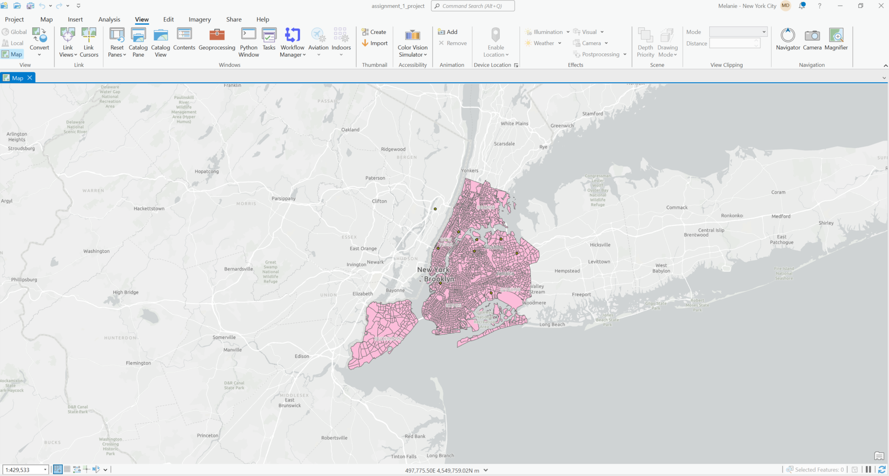

## Common Errors

### Q: Where did my pane go?

A: We can always get different panes back (table of contents/catalog) by going to View > Reset Panes > Reset Panes for Mapping

### Q: I added a new file into my working folder, but the file has not appeared.

A: Right-click on your working folder and click refresh (can also hit F5) this will refresh the folder connection and if your file is in that folder and unzipped, it should appear.

