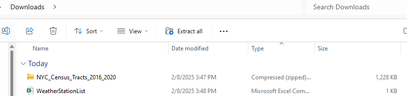
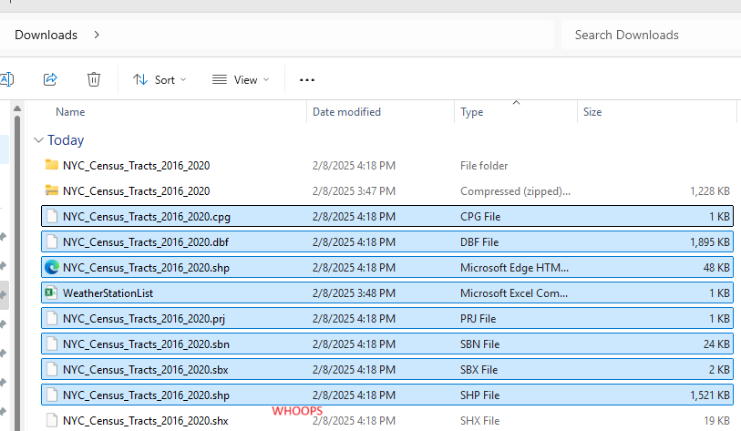
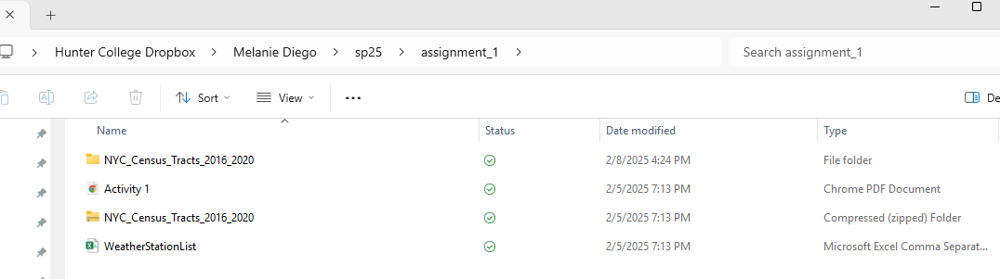
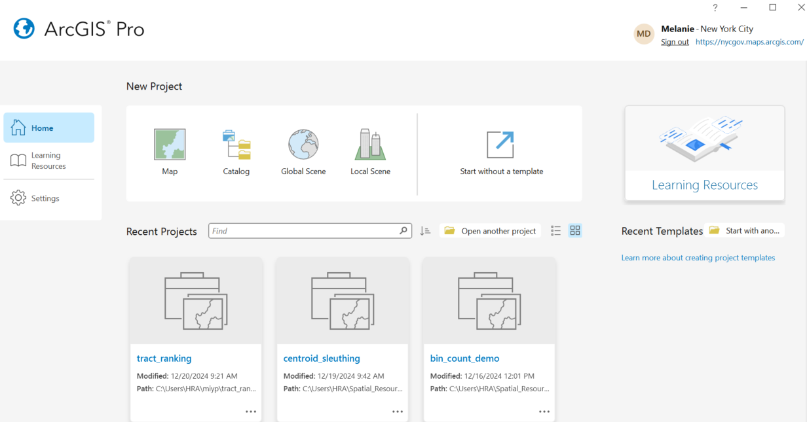
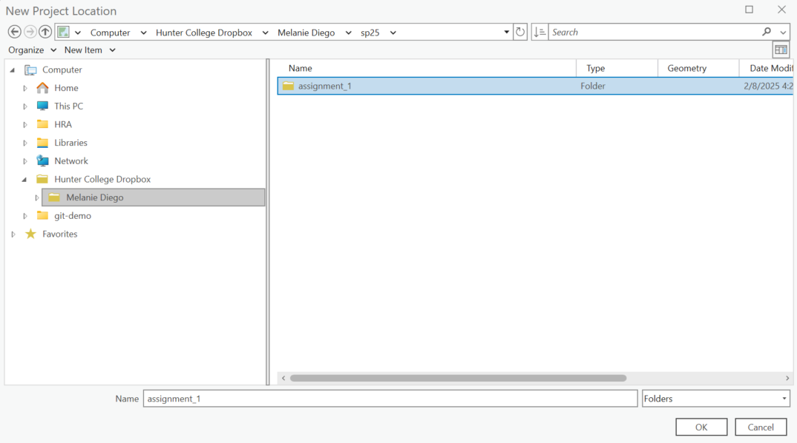
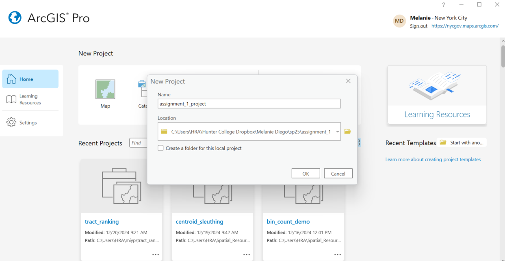
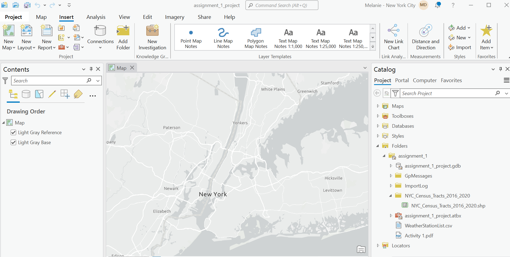
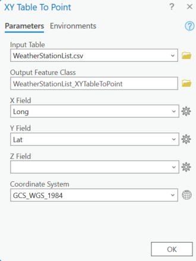

# Here is some documentation on getting started with your first projects in ArcGIS Pro

## File Downloads/Storage

Typically our workflow will be to download data from either Brightspace or an external resource, and move that data from it's download location (Downloads Folder, Desktop) into your working directory for the course, and a specific subfolder for that assignment or activity. 

The most important thing to remember when we move zipped shapefiles is to unzip them after we place them in the desired folder - that way we can ensure we don't lose any components of the multi part file.

Once we move the data to our course folder and subfolder, then we want to make sure our files are extracted. (Right-click, Extract All)

In this case I am syncing to my dropbox folder (app) > Melanie Diego > sp25 > assignment_1

Now we can connect this file folder to our new project in ArcGIS Pro

## Connecting to Pro

Open ArcGIS Pro (Desktop Software). You will get this screen upon opening. Once signed in you will see your credentials in the top right.

Under New Project, select Map and you will get the New Project Dialog. We will change the Location path from the default location (somewhere random in Documents) to the working folder we just set up. Because we want to be linked to that folder, we will just single click it in the navigation menu. This lets the software know we want to connect to that folder, versus looking for one to connect to inside of it. We will also change the Name to something that makes sense and **UNCHECK** the Create a folder for this local project.

Selecting assignment 1 folder

Your dialog should look like this:

##Adding Data

Our new project will look like this. 

We call now pull the relevant data in by dragging it over from the catalog into the map frame. If we don't see the data in our Catalog it could be for a few different reasons. 

###Troubleshooting
We may have not set up our data correctly. My first move would be to check out the files in Windows Explorer to ensure they are actually in the folder you think they are/the folder you connected to in Pro. My second move, if you are connected to the folder you intended would be to make sure the files are unzipped. My third move would be to reconnect to the correct folder if something went wrong during the linking process.

Remember it's not big deal to connect to a different folder, we will often have to do so as we work with more data. The point of connecting to your working folder at the beginning is to keep your inputs and outputs for a particular assignment in one place. To add a new connection we just need to right-click on Folders and select Add Folder Connection.

## Creating our Point Layer

Once we have pulled both files into our project, only our Census Tract shapefile appears immediately visible. This is because despite having spatial information (in the form of coordinates) it is not a spatial file. We need to run the XY Table to Point tool to "plot" our coordinates into our map.

To do so, we will right-click on our csv in the Table of Contents > Create Points from Table > XY Table to Point.

We can keep the tool dialog exactly as is. We can see our input table is WeatherStationList.csv, our output feature class is our file name with the default naming extension, that if we click the file folder we can see is being exported to our default geodatabase, our X and Y coordinates have been identified from the data as Long/Lat, and our coordinate system is WGS 1984.

Now we should have our polygon and point file in our map!