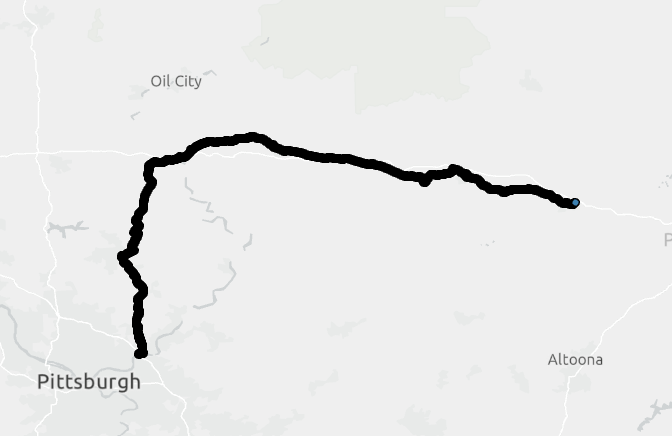

# Working with GPX data

After downloading the GPX file and opening a new project - we will not see the GPX file in our catalog even if we have placed it in the folder we are working out of. To get the file visible and into our map, we will run the GPX to Features tool. Analysis > Tools > GPX to Features. Within the tool we will navigate to where we have stored the GPX file for our input, and rename the output to something a bit more straightforward than the Konmoot standard format.

After the tool runs we will have a file depicting the waypoints of the route. The output of our tool will be in our default geodatabase (unless you changed the location).

To convert our waypoints to a line, we can use the Points to Line tool. Analysis > Tools > Points to Line

Now that we have a line, we can calculate the distance of the line, but first - we want to make sure we project into the correct coordinate system. For this data we can project into the State Plane NAD 1983 Pennslyvania North FIPS 3701 US Feet. 
Analysis > Tools > Project 
Output Coordinate System > Hit Globe
Projected Coordintate Systems > State Plane > NAD 1983 US Feet > Pennslyvania North FIPS 3701

Remember to see the changes reflected in your map you will also need to adjust the coordinate system in the Map Properties.

In our attribute table, we can now add a new field called DistMi to calculate the distance in miles.
Attribute Table > Add New Field

Close the Fields Menu and Save your changes.

Right-click on new field and select Calculate Geometry

Now we have the pieces we need to calculate speed, the distance and the time of the first and last waypoint. There are a few ways we can calculate the time duration. We could copy and paste the start and end time (first, last) into excel. Then we could use a formula to subtract one from the other, and multiply by 24 to get the duration of hours.

Then, in our line Attribute table we can create a new field called speed_mph and divide our total distance by the duration in hours.

