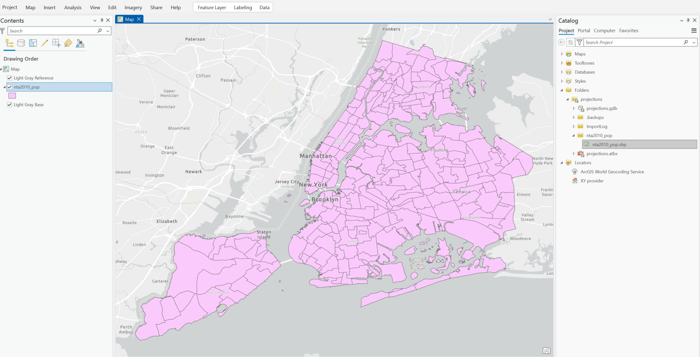
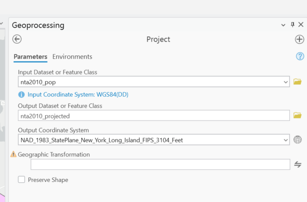
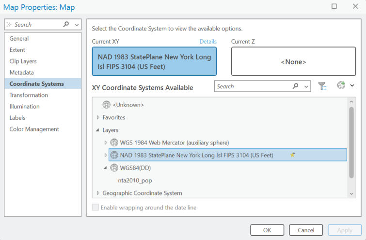
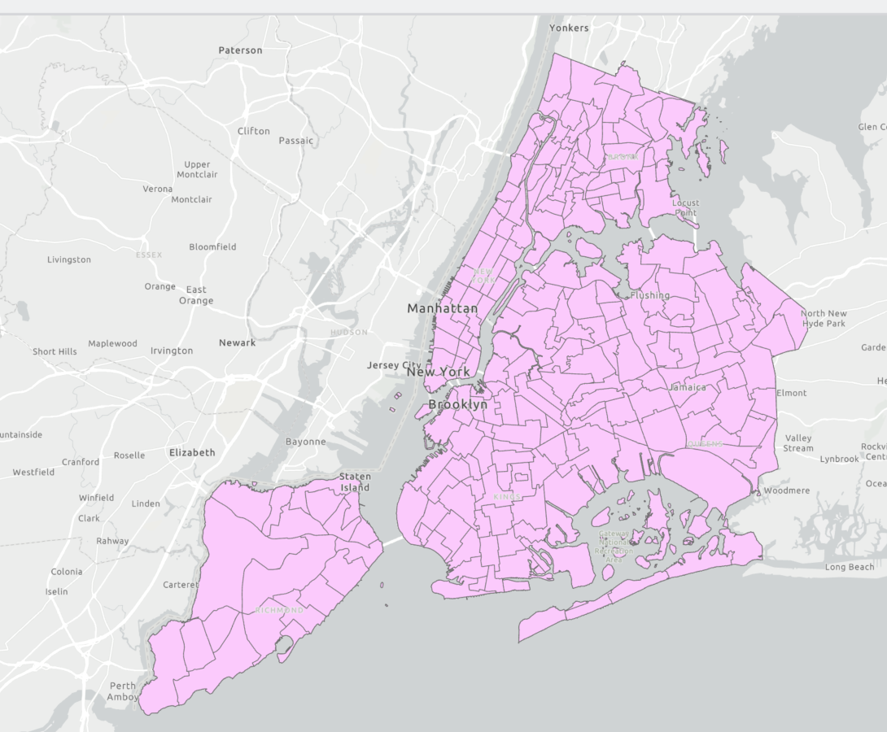

# Project Tool

The project tool projects spatial data from one coordinate system to another. We should consider projecting our data especially important when we are:
1. Making maps to be published/want things to be cartographically sound
2. Calculating measurement and distances

When you download data from various sources it may be unprojected. You will likely get used to what New York looks unprojected - slightly oblate and flattened. 

We will typically want to project data in the New York City area to NAD 1983 StatePlane New York Long Island FIPS 3104 (US Feet).

To do so we will open the Project tool. Analysis > Tools > Project

In the tool dialog we can navigate to Projected Coordinate Systems > State Plane > NAD 1983 (US Feet) > NAD 1983 StatePlane New York Long Island FIPS 3104 (US Feet).

After we run the tool, we won't see anything look different. That's because we also need to change the PCS of the map. We can do that by righ-clicking on Map in the table of contents > Properties > Coordinate Systems and also setting to NAD 1983 StatePlane New York Long Island FIPS 3104 (US Feet)

After changing that, we will see the map look a bit more accurate for New York City.

