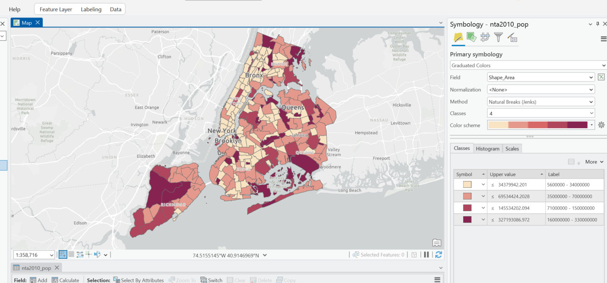
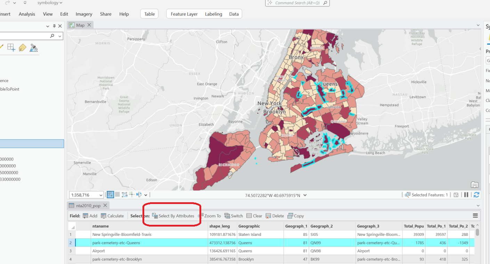
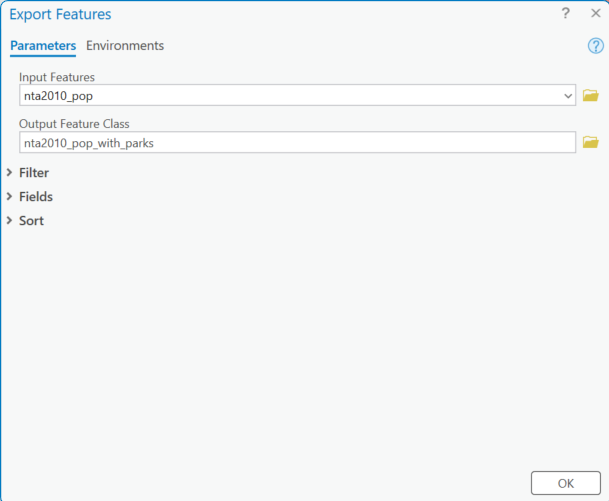
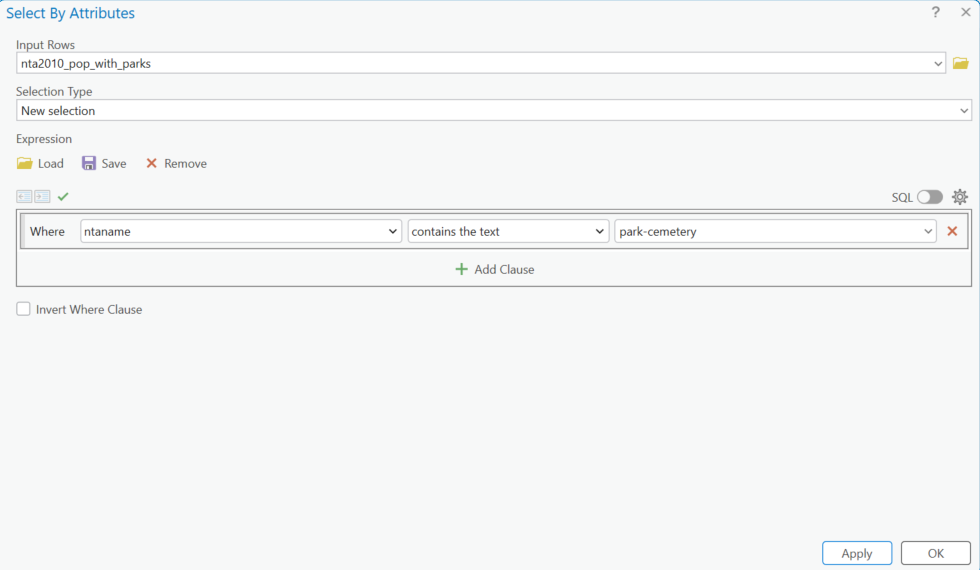
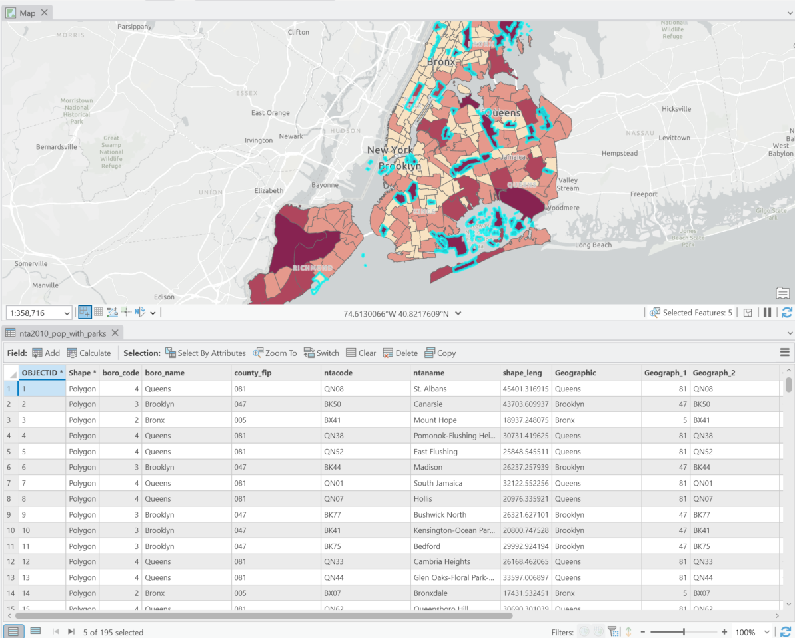
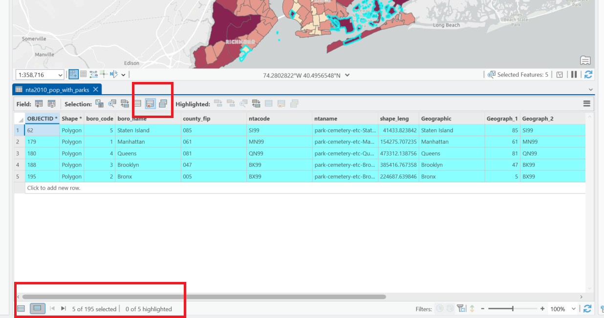
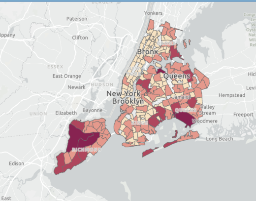

# Select by Attribute

## NTA File Example

When we mapped our NTAs by Shape_Area, we noticed an issue with the data. Several parks are depicted darker, indicating a higher area - but we can see from the size of geography this is not true. 

We can see the issue when we sort Shape_Area descending in the attribute table, seeing an NTA name of park-cemetery-etc-Queens, with park-cemetery-etc-Brooklyn and park-cemetery-etc-Brooklyn below. When we highlight that one row in the attribute table, we see all parks in Queens highlighted in the map. 

This means we can assume the data for these parks is not worth visualizing as tied to these features on the map, because it is summing the attributes across all parks. For correct symbology and data accuracy we should take the parks out of the dataset. To do we will use the Select by Attribute tool.

Before we do so, we should export a copy of this data to keep the version with the parks included/or in case we make any mistakes. To do so we want to right-click on the layer in the table of contents > Data > Export Features. We want to make sure no features are selected before we do this, because that would only export the selected values. The default export location will be our default geodatabase. 

When the tool is finished, the copy of the data will appear automatically in the Table of Contents. We should remove the shapefile from the table of contents so it is clear which file we are editing.

Now we will navigate to the Select by Attributes menu. This will allow us to do a SQL expression to select the features we want based on data in the attribute table. For this expression we want to select all the parks, regardless of Borough - so we will use ntaname - contains the text - park-cemetery. This will select all of those features. 

After we press OK - we should see five features selected in the attribute table (and several more on the map)

We can toggle to view just the selected features in the bottom left, and then delete those features.

Now we have a more accurate symbology/symbology breaks.

Select by attribute is a useful tool for isolating portions of your data.