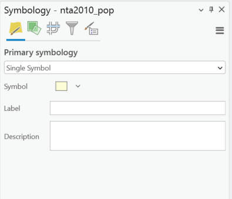
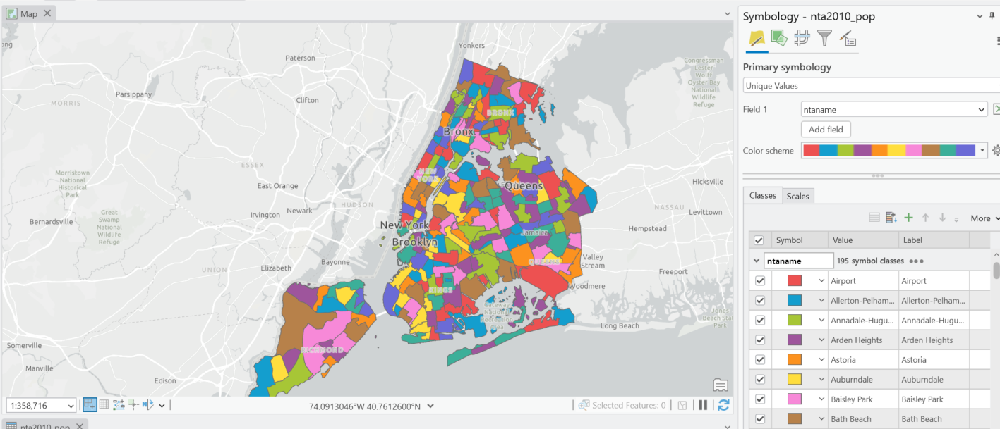
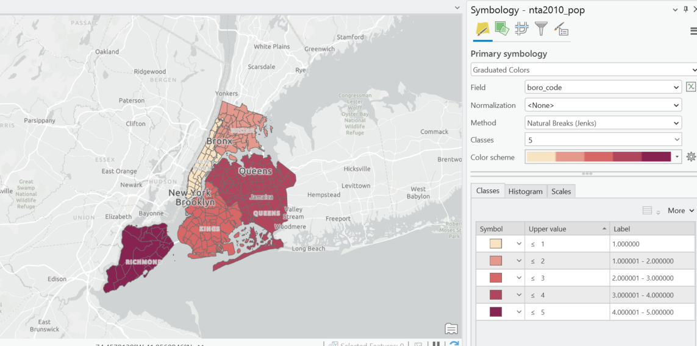
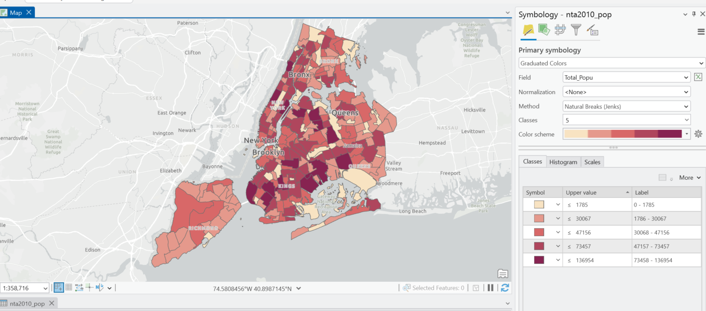
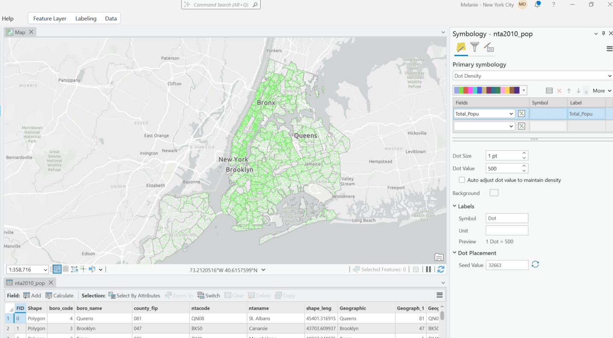
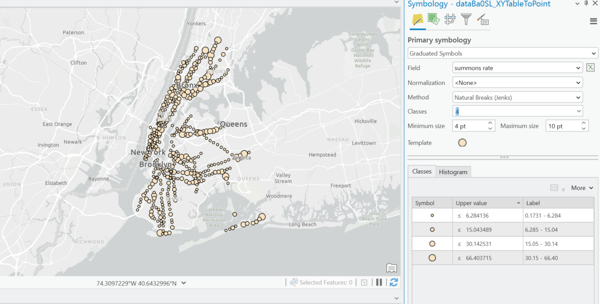
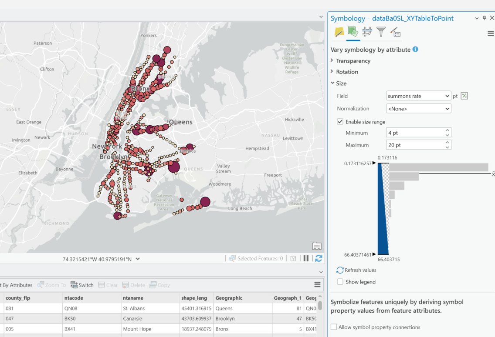

#Symbolizing Data

Once our data is in ArcGIS Pro, the software provides several symbolization methods for feature layers. In choosing our symbology scheme we want to consider the objective of our map, the format of our data, and the attribute data available to us. We also want to think about features we may choose not to symbolize or make sense to filter out of our dataset based on the symbology scheme we choose (ex. Park geographies in NTA file that each have have cumulative statistics, Census data with a value of 0)

#Primary Symbologies in ArcGIS Pro

1. Single Symbol: Draw all features in a layer with a common symbol
2. Unique Values: Apply a different symbol to each category of featres within the layers based on one or more fields. 
3. Graduated colors: Show quantiative differences in features values with a range of colors.
4. Graduated symbols: Show quantiative differences in feature values with varying symbol sizes. 
5. Bivariate colors: Use graduated colors to show quantitative differences in feature layers between two fields.
6. Unclassed colors: Show quantitative differences in feature values with a range of colors not broken into discrete classes.
7. Proportional Symbology: Represent quantitative values as a series of unclassed, proportionally sized symbols.
8. Dot density: Draw quantities as point symbols distributed within polygons. This method is only available for polygon features.
9. Charts: Draw quantities from multiple fields using chart symbols.
10. Heat map: Draw the density of points as a continuous color gradient.
11. Dictionary: Apply symbols to data using multiple attributes.

# Looking at our NTA Population file from 2010 - 2020 as an example:

To start, we can either right click on our feature layer in the table of contents and select symbology, or use the feature layer menu in the top ribbon and navigate to symbology. 

Under the primary symbology drop down we can select a scheme. Here we see the default single symbol, showing all features the same way.

If we wanted to symbolize our data by a qualitative field in our data (ex. categories, names) we could use Unique values, and select which field in our data we want to symbolize. These colors don't tell us anything about the data other than it is different. 

We want to keep in mind that categorical data is sometimes stored in a number format. For example in this data there is a field called boro_code, which even though is a number, does not indicate anything quantiative about the borough it represents. Here I've used graduated colors to symbolize boro_code. The result is an identical map to a unique value scheme by borough name. 

To correctly use graduated colors, we would want to apply it to a field in our data that actually represents quantitative data. Let's try it on the Total_Popu field, which is the population in 2010. 

With graduated colors Pro will apply a classification method. Natural Breaks is typically appropriate because it takes into account the statistical distribution of your data. Quantile will divide your data into five equal classes. Standard deviation assumes your data is normally distributed and will show symbolization relative to the distance away from the mean of the data. Depending on what you want to show you may also want to set the breaks manually as well. For more finished work you will want to give some thought to your classification method in relation to the objective of your map, and make sure you have a legend with the breaks available.

We also see the option for Normalization, which divides the data by that field. This could be useful if you wanted to symbolize population in relation to area, or total cases of something per the population.

With polygon fields we can also use the dot density scheme. Here is the same 2010 field in that format. Here, one dot is representing 500 people.

We can use graduated symbols for point data. 

If you want to use graduated colors and symbols, I would recommend setting the primary symbology as graduated colors, and then on the vary symbology by attribute tab, selecting size. Here I am setting both to the same field (summons rate) but these could be separate fields in your data as well. 

